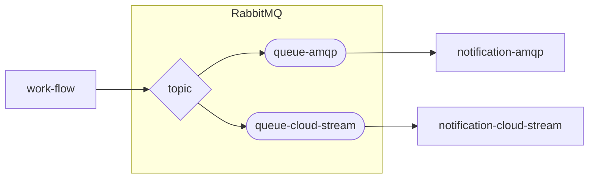

# ワークフロー アプリケーション

## kintone
### pros
#### 開発
- フォーム、一覧、グラフは簡単にできる
- Export,Importも用意されている
#### 運用

### cons
#### 開発
- 画面（form）に業務ロジック（計算、判断、加工) を記述するので、重複する
- 非同期連携できない（トピック、キュー）
#### 運用
- 他のアプリケーションの参照はコピーなので、最新かどうかはわからない（再取得が必要）

| TH      | pros | cons |
|---------|------|------|
| kintone | TD   | TD   |
| 自作      | TD   | TD   |

## 非同期
### rabbitmq
- routing key
  - https://www.rabbitmq.com/tutorials/tutorial-five-python.html
  - 
- cloud stream 
  - routing key の設定
  - https://cloud.spring.io/spring-cloud-static/spring-cloud-stream-binder-rabbit/3.0.1.RELEASE/reference/html/spring-cloud-stream-binder-rabbit.html#_rabbitmq_consumer_properties

